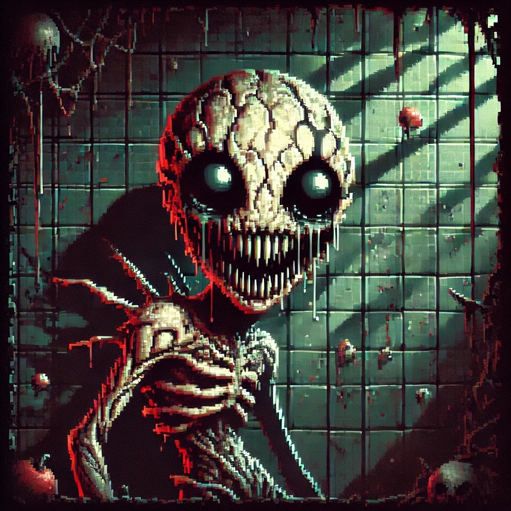

# Nightmare Spawn

### Description
Colton Richard, Ryan Kerlick, Victor Lopez, David Castillo

This project is a **Godot 4.3-based dungeon crawler** where players explore rooms, search for loot, and battle enemies. Each floor concludes with a Boss Room. Defeating the boss allows players to progress to the next floor in an endless cycle of increasingly difficult challenges until the player is defeated.

The game is designed for gamers familiar with challenging gameplay, but there's enough room for novices to learn and adapt. Our team has always been intrigued by this genre, and the project offers an opportunity to delve into game development and refine our git collaboration skills.

## Table of Contents
* [General Information](#general-information)
* [Technologies Used](#technologies-used)
* [Features](#features)
* [Screenshots](#screenshots)
* [Setup](#setup)
* [Usage](#usage)
* [Project Status](#project-status)
* [Room for Improvement](#room-for-improvement)
* [Acknowledgements](#acknowledgements)
* [Contact](#contact)

## General Information
- **Nightmare Spawn** is a high-difficulty dungeon crawler inspired by classic roguelike games. 
- It aims to provide an immersive and challenging experience where players can hone their skills in combat and strategy.
- The game allows our group to explore procedural generation, character states, and advanced Godot features while enhancing our team-based coding practices.

## Technologies Used
- **Godot 4.3**
- **Aseprite** - version 1.2 for pixel art and sprite animations
- **Jira** - version 8.20 for project management and issue tracking
- **Bitbucket** - version 7.6 for version control and team collaboration

## Features
- 2D Top-down player movement
- Boss fights with unique mechanics
- Player state management (health, inventory, abilities)
- Enemy state behavior (patrolling, attacking, defending)
- Procedural generation of dungeon rooms and loot

## Screenshots

## Setup
### Requirements:
- Godot 4.3
- Aseprite (for modifying sprites)
- Jira and Bitbucket for project management and version control

### Installation:
1. Clone the project repository from Bitbucket: `git clone https://clr269@bitbucket.org/cs3398-miranda-f24/project.git`
2. Open the project in Godot 4.3
3. Run the project to ensure all dependencies are correctly installed.

## Usage
- **Movement**: Use the arrow keys or WASD to navigate through the dungeon rooms.
- **Combat**: Attack enemies with the assigned keys, dodge, and use special abilities when available.
- **Objective**: Defeat the boss of each floor to progress.

## Project Status
The project is currently **in progress**. Core mechanics like player movement and boss fights are implemented, while additional levels, enemy types, and loot are under development.

## Room for Improvement
- More enemy types and behaviors to enhance gameplay variety.
- Additional player abilities and power-ups.
- Improve room generation to allow for more complex and engaging dungeon layouts.

To do:
- Implement a save/load system.
- Add difficulty scaling for advanced players.

## Acknowledgements
- This project is inspired by games like *The Binding of Isaac* and *Enter the Gungeon*.
- Thanks to the open-source community for contributing to Godot 4.3 development.
- Special thanks to the tutorial resources on game development and procedural generation.

## Contact
Created by **Colton Richard, Ryan Kerlick, Victor Lopez, David Castillo**. Feel free to contact us for collaboration or feedback!
